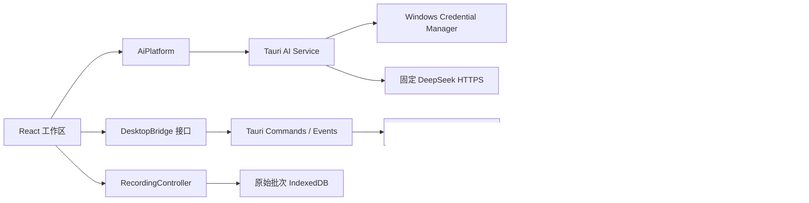

# DiCar Tune 开发文档

本文说明 DiCar Tune 0.2.0 的代码边界、开发环境、质量门禁和 Windows 打包流程。使用说明见[用户手册](user-guide.md)。

当前 `release/` 内 0.2.0 安装版与便携版已于 2026-08-15 按第 7、9 节完整流程重新构建，包含旧首页四入口与精准控制台工作台的兼容合并；版本号与 Rust/Tauri 后端逻辑未改变。

## 1. 架构



主要边界：

- React 只消费快照和桥接事件，不直接打开串口或构造 DCTP 帧。
- `AppShell` 固定提供概览、实时调试、波形记录、诊断四个顶部路由；首页另以四张真实功能卡呈现实时调试、记录回放、参数方案和链路诊断。`ConnectionDrawer` 仍是唯一连接表单并只调用既有 `DesktopBridge`。
- 车辆 YAML 只把 Manifest 的精确 `machine_name` 解析成任务；resolver 输出稳定的 `paramId`/`channelId`，不修改设备 DTO。
- Tauri 层负责类型化命令、事件转发、串口发现和内置模拟器生命周期。
- 独立 `AiPlatform` 把 React 与 Tauri AI command 隔离；Rust AI service 独占凭据、HTTP、限制和取消，Key 不进入前端状态。
- `RecordingController` 在唯一 Bridge 事件入口先复制原始遥测批次，再交给实时绘图 store；IndexedDB 和回放不修改 DCTP wire 或设备状态。
- `dicar-app-core` 负责单线程 AppActor、会话、权限策略、参数工作区、链路预算和遥测缓冲。
- `dctp-protocol` 只负责 DCTP v1 编解码和 payload 模型，不执行 IO。
- `dctp-sim` 是确定性的 TCP 设备模拟器，用于协议、参数、遥测和桌面集成测试。
- `firmware/dctp-device` 是车端 C99 参考实现：只依赖注入的串口、Flash 和时钟回调，不含具体芯片外设代码；`crates/dctp-device-c` 在 `cargo test` 时把它编译进来，用黄金向量和 Rust 协议栈做逐字节交叉验证（需要本机 C 编译器，Windows 上为 MSVC）。移植方式见 [firmware/dctp-device/README.md](../firmware/dctp-device/README.md)。

## 2. 仓库结构

```text
apps/
  dicar-desktop/
    src/                 React + TypeScript UI、bridge、stores
    src-tauri/           Tauri 2 Windows 壳与 Rust commands
    e2e/                 Playwright 关键流程
crates/
  dctp-protocol/         DCTP v1 wire codec 与消息模型
  dctp-sim/              确定性模拟设备和 TCP server
  dctp-device-c/         车端 C 参考库的 Rust 交叉验证 harness
  dicar-app-core/        会话、AppActor、参数与遥测核心
firmware/
  dctp-device/           车端 DCTP v1 参考库（C99）与移植指南
docs/
  user-guide.md          使用者手册
  development.md         本文
  superpowers/           设计规格与实施计划
release/                 当前 Windows 发布文件（主工作区）
```

前端通过 `DesktopBridge` 抽象选择 Tauri、Web Serial 或 Mock 实现。纯 Web 预览的真实 DCTP 会话尚未完成，不能把浏览器授权端口误报为已连接设备。

### 车辆配置 schema v1

内置配置放在 `apps/dicar-desktop/src/vehicleProfiles/builtins/`，由 Vite 作为 raw text 打包并在模块初始化时严格解析。最小完整示例：

```yaml
schema_version: 1
vehicle: { id: my-diff-car, display_name: 我的差速车, type: 双轮差速, order: 50 }
control_loops:
  - id: speed
    label: 速度环
    target_parameter: control.target_speed_mps
    gains: { Kp: pid.kp, Ki: pid.speed.ki, Kd: pid.speed.kd }
    telemetry:
      target: drive.target_speed_mps
      feedback: drive.speed_mps
      error: drive.speed_error_mps
      outputs: [motor.left_pwm, motor.right_pwm]
    recommended_channels: [drive.target_speed_mps, drive.speed_mps, drive.speed_error_mps]
parameter_sections:
  - { id: encoder, label: 编码器, parameters: [encoder.left.ppr, encoder.right.ppr] }
scope_presets:
  - { id: drive, label: 驱动总览, channels: [drive.speed_mps, motor.left_pwm, motor.right_pwm] }
```

约束：ID 仅允许小写 ASCII、数字、`-`、`_`；拒绝 YAML 锚点、别名和 merge key；未知字段报错；每类最多 32 项、每项最多 64 个引用。单文件 256 KiB，用户配置最多 16 个且总计 2 MiB。绑定区分大小写且不使用显示名称。解析问题为导入失败；Manifest 兼容问题按 error/warning 记录并保留有效任务，所有参数始终可从通用工作区访问。

## 3. 开发环境

通用要求：

- Node.js 22 或更高（`.node-version` 固定当前推荐版本）
- pnpm 11（仓库声明 `pnpm@11.16.0`）
- Rust stable
- Git

Windows 桌面开发和打包还需要：

- Visual Studio 2022 C++ Build Tools
- Windows SDK
- MSVC Rust target：`stable-x86_64-pc-windows-msvc`
- Microsoft Edge WebView2 Runtime

安装 Rust target：

```powershell
rustup target add x86_64-pc-windows-msvc
```

## 4. 安装依赖与运行 Web

在仓库根目录执行：

```powershell
pnpm install --frozen-lockfile
pnpm dev
```

浏览器打开：

```text
http://127.0.0.1:5173/
```

Web 预览默认提供确定性模拟体验。支持 Web Serial 的 Chromium 浏览器可以授权和识别 USB 串口，但真实 DCTP 会话仍应使用 Windows 桌面 App。
Web 预览不启用 AI，也不接受或保存 DeepSeek Key；只有 Tauri Windows 桌面壳会创建可用的 `AiPlatform`。

### 精准控制台前端结构

- 顶部设备状态芯片只显示连接真值，点击后打开 `ConnectionDrawer`；抽屉分为连接、硬件指南和偏好，导航后窄屏抽屉会关闭。
- `settingsStore` schema v4 在既有串口与 `aiModel` 设置外增加 `workbenchMode: "standard" | "track"`。该字段只影响 CSS grid 与密度，不进入 `DesktopBridge`，切换模式不发送订阅、暂停、写参数或固化命令。
- `WorkbenchLayout` 始终按导航、编辑器、波形的同一 DOM 顺序渲染；标准/赛道模式不会卸载编辑器或波形，因此参数草稿、录制状态和实时缓冲保持不变。
- `TelemetryStrip` 只读取已解析控制环、RAM 参数、绘图环形缓冲和 `AppSnapshot`；缺失字段显示“—”，不推算实测 RX 速率或健康评分。
- `RecordingLibrary` 复用现有 `RecordingController`，由 `/records` 独立页面承载；回放仍使用独立只读缓冲。
- 参数方案没有第二套页面或 store：`/live?panel=snapshots` 打开工作台现有 `SnapshotManagerDialog`，关闭时只移除 `panel` 查询参数并保留其他参数；旧 `/parameter-sets` 使用 replace 重定向到该地址。
- `FirmwareFlashEntry` 当前只接受类型化前端状态并固定传入 `unavailable`，没有 Tauri command、Bridge 方法或 Rust 后端绑定。不得把禁用入口描述为已支持无线烧录。

## 5. 运行模拟器

查看 CLI：

```powershell
cargo run -p dctp-sim -- --help
```

在固定 TCP 地址运行独立模拟器：

```powershell
cargo run -p dctp-sim -- --listen 127.0.0.1:7100
```

Windows 发布版使用 Tauri 内嵌的 `SimulatorServer`，监听系统分配的本地端口，不依赖上述独立进程。

Rust `dctp-sim` 与 Web `MockBridge` 都实现相同语义的简化速度闭环：固定 2 ms 内部控制步长、PID 控制器和一阶车辆惯性。以下稳定名称在内置车型中构成完整调参契约：

- `pid.kp`、`pid.speed.ki`、`pid.speed.kd`：可写、可持久化，但自动调参只修改 RAM，固化仍需人工确认。
- `control.target_speed_mps`：可写、dangerous、非持久化，仅作为实验激励，不进入 Flash dirty/commit 集合。
- `drive.target_speed_mps`、`drive.speed_mps`、`drive.speed_error_mps`、左右轮速和左右 PWM：由闭环模型动态生成。

Mock 遥测按请求采样率生成设备时间戳，并仅在设备 ready、订阅 active、未暂停且存在监听者时运行实时调度器。AI 向导结束、失败或中止时会恢复实验前目标值与订阅/暂停状态；如果实验前没有订阅，则明确清除实验订阅。该清除操作复用 DCTP v1 `TELEMETRY_STOP`，没有增加 wire message。

## 6. 运行 Windows 桌面 App

确保当前终端已加载 Visual Studio MSVC 环境，然后从仓库根目录运行：

```powershell
pnpm --filter @dicar/desktop exec tauri dev
```

Tauri 会执行配置中的 `beforeDevCommand`，启动 Vite，并创建 Rust AppActor 与内置模拟器。真实串口连接由 Tauri command 将前端 `Endpoint` 映射为核心类型：

```text
Simulator { address }
Serial { portName, baudRate, hardwareProfile }
```

`hardwareProfile` 当前可取：

- `nanoUartWl`
- `hc05BluetoothSpp`
- `genericSerial`

### 安全 AI 桌面通道

`apps/dicar-desktop/src-tauri/src/ai_service.rs` 是与设备 `AppState` 分离的服务。
它固定请求 `https://api.deepseek.com/chat/completions`，禁止重定向，连接/总超时
分别为 10/60 秒，并以流方式把响应限制在 1 MiB。模型名只接受 1–64 个安全
ASCII 字符。每个请求使用前端生成的 UUID 和 `CancellationToken` 注册；
`ai_cancel` 会真正终止 Rust Future，RAII guard 负责所有正常、错误和 Future
drop 路径的请求表清理。

凭据适配使用精确 `keyring 3.6.3` 的 `windows-native` 后端，服务/用户为
`com.dicar.tune` / `deepseek-api-key`。Tauri 注册以下命令：

- `ai_credential_status`
- `ai_set_api_key`
- `ai_clear_api_key`
- `ai_complete`
- `ai_cancel`

前端 `settingsStore` schema v4 保存串口偏好、`aiModel` 和纯前端
`workbenchMode`，迁移在 Zustand hydration 前直接清除旧 `aiBaseUrl`/`aiApiKey`。
React 只消费 `AiPlatform`，不直接 import
Tauri invoke。Rust 测试用内存凭据替身和本地 HTTP server，自动化不访问真实
DeepSeek。

### 原始波形记录与回放

`useBridgeSubscription` 是唯一事件扇出。它先调用 `RecordingController.acceptEvent`
（同步深拷贝事件并进入单一 Promise 队列），再更新连接和 60 秒绘图 store。
记录仓储使用原生 IndexedDB `dicar-tune-recordings` v1：

- `recordings` 以记录 UUID 保存元数据；
- `recordingChunks` 用 `[recordingId, chunkIndex]` 复合主键保存完整 `UiTelemetryBatch`，并按 `recordingId` 建索引；
- 时间跨度达到 1 秒或累计 4096 点时写块；单次 5 分钟，库上限 20 条 / 256 MiB；
- 所有写入串行；写失败删除整条活动记录，启动时删除所有非 complete 记录；
- 导入先做 schema v1 全量验证，再在单个事务内写元数据和全部块；清理旧记录也与导入处于同一事务。

JSON 保存元数据和原始批次；CSV 是按采样时刻展开的宽表并处理公式注入。
导出和回放用引用计数保护记录不被容量清理。回放把完整记录加载进独立
`TelemetryRingBuffer`，只向 `WaveformCanvas` 传显式 `viewportEndUs`；它不读取
实时 store，也不调用 `DesktopBridge`。记录管理由 `/records` 的
`RecordingLibrary` 呈现；工作台只保留开始/停止录制和进入该页面的链接。

## 7. 质量门禁

### 前端

```powershell
pnpm lint
pnpm typecheck
pnpm --filter @dicar/desktop test --run
pnpm build
pnpm test:e2e
```

当前前端基线为 42 个 Vitest 文件 / 187 个测试、11 个 Playwright 场景。覆盖范围包括 bridge 合同、车辆 YAML 安全边界、Manifest 兼容解析、设置 v4、双模式零设备命令、设备抽屉、四卡首页与旧路由兼容、遥测指标条、参数编辑、参数方案（保存/差异应用/固化记录）、安全 AI command/取消/凭据迁移、原始记录分块/限额/原子导入、独立记录页与回放、编码器、波形、权限、诊断语义分组、窄屏导航和 axe 可访问性。Playwright 使用 Mock 验证首页响应式布局、参数方案深链接、录制、订阅变化封存、回放和 JSON/CSV 下载，不调用真实 DeepSeek。

### Rust workspace

通用开发环境：

```powershell
cargo fmt --all -- --check
cargo clippy --workspace --all-targets -- -D warnings
cargo test --workspace --all-targets
```

Windows 发布前使用 MSVC toolchain 复跑：

```powershell
cargo +stable-x86_64-pc-windows-msvc fmt --all -- --check
cargo +stable-x86_64-pc-windows-msvc clippy --workspace --all-targets -- -D warnings
cargo +stable-x86_64-pc-windows-msvc test --workspace --all-targets
```

关键约束包括：

- 任何可靠请求均保持同一 Sequence 重试。
- 错误 Session 和精确 3000 ms 失效边界会停止写入。
- 参数 ACK 是 RAM 与 Revision 的权威来源。
- Commit 以冻结的参数集合和 canonical CRC 原子确认。
- 串口失败或 DCTP 握手失败不会残留“已连接”身份。
- 链路预算在发送 `TELEMETRY_SUBSCRIBE` 前由核心验证。

## 8. DCTP 黄金向量

验证已提交的六个 DCTP v1 二进制向量：

```powershell
cargo run -p dctp-sim --bin generate_vectors -- --check
```

成功输出：

```text
DCTP v1 vectors match
```

仅在有意修改 wire contract 时才运行不带 `--check` 的生成器。协议变更必须同时审查：

- 帧布局和 COBS/CRC；
- 消息类型与 flags；
- 参数 value、state、write、commit；
- Manifest 分片和协商载荷上限；
- 遥测批次、序列缺口和 dropped counter；
- 旧黄金向量是否构成兼容性承诺。

## 9. Windows 打包

版本号必须同时更新：

- `apps/dicar-desktop/package.json`
- `apps/dicar-desktop/src-tauri/Cargo.toml`
- `apps/dicar-desktop/src-tauri/tauri.conf.json`
- `Cargo.lock` 中的 `dicar-desktop` 条目

在 Visual Studio x64 开发环境中执行：

```powershell
pnpm --filter @dicar/desktop tauri:build
```

若 Windows Smart App Control 误拦 Cargo 生成的未签名 build script，不要关闭系统策略；
可只改变可再生中间产物的哈希后重试，最终应用仍使用优化 release profile：

```powershell
$env:CARGO_PROFILE_RELEASE_BUILD_OVERRIDE_DEBUG = "1"
pnpm --filter @dicar/desktop tauri:build
```

默认输出：

```text
target/release/dicar-desktop.exe
target/release/bundle/nsis/DiCar Tune_<version>_x64-setup.exe
```

发布前应执行：

1. 完整前端、Rust、Playwright 和黄金向量门禁。
2. 将安装版和便携版复制到主仓库 `release/`，使用统一名称。
3. 计算 SHA-256。
4. 实际启动便携版，确认进程保持运行且内置模拟器拥有监听端口。
5. 只终止本次测试启动的精确 PID。
6. 在新版本验证后清理旧发布文件和任务专用构建目录。

## 10. 修改硬件适配时的约束

新增硬件配置时应保持以下边界：

- 在 Rust 与 TypeScript 中使用相同的 `SerialHardwareProfile` 序列化名称。
- 波特率必须经过明确 allow-list，不把任意数字直接传入串口层。
- 自动探测只调用连接流程，不写参数、不固化 Flash、不启动遥测。
- 只有完整 DCTP 握手和设备加载成功后才能保存端口配置。
- 失败尝试必须保持 Disconnected，不能留下 `transportIdentity`。
- 每种硬件配置必须定义保守的 `TelemetryBudget`。
- UI 限制用于指导使用者，核心限制才是不可绕过的安全边界。
- 不根据商品宣传直接承诺距离、速率或抗干扰性能；实体链路必须单独验证。
- HC-05 使用 Windows Bluetooth Classic SPP 传出 COM，不把它描述为 Web Bluetooth。
- 当前无线烧录只有 `FirmwareFlashEntry` 禁用入口。开始实现前必须先写安全边界、失败恢复、固件兼容和断电恢复规格，再设计后端命令；不得复用普通参数固化文案冒充固件升级。

## 11. 贡献建议

- 一次变更只解决一个清晰问题，避免同时重写协议、核心和 UI。
- 修改行为前先添加能失败的聚焦测试，再实现最小修复。
- 公共类型和 wire layout 的修改视为潜在 breaking change。
- 保持 UI 只消费 bridge/store，不在组件中直接调用 Tauri API。
- 不提交 `target/`、临时测试目录或已被替代的发布二进制。
- 每个里程碑结束时检查旧发布物、临时输出、失效文档和被替代资产；先解析并核实精确路径，优先移入回收站或采用其他可恢复清理方式，不使用宽泛递归删除。
- 下一项新增产品能力是无线固件烧录后端与硬件流程；实体 nanoUART-wl/HC-05 验证排在其后，并必须等待用户确认硬件就绪。其他工作只完善现有功能与 UI。
- 提交前运行与变更范围匹配的聚焦测试，并在最终阶段运行完整门禁。

返回[项目 README](../README.md)或查看[用户手册](user-guide.md)。
